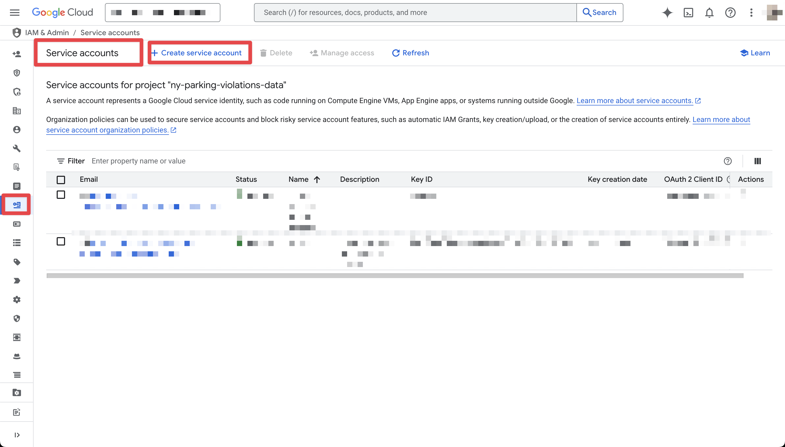

# Project
Simple batch data engineering pipeline to extract transform and load open NY Parking Violations Data, visualized in Looker (https://lookerstudio.google.com/reporting/a8ea847b-ece9-43af-9f59-99b913a42dd1)

<p align="center">
  
</p>

# Problem description
- Every year NY Government publishes a [dataset](https://data.cityofnewyork.us/browse?tags=dof+parking+violations+issued+-+data+collection) of parking violations for the fiscal period
- The data is published separately for each year, so it's impossible to query one dataset to compare different periods
- Moreover, every file can have slightly different set of columns and stores information suboptimately
- This pipeline is aimed to solve these problems by downloading every dataset in csv, transforming it and storing all the data in a data warehouse in BigQuery, ready for analysis
# Pipeline Description
## Data ingestion
We use Airflow for orchestration, the steps are:
- Launch the DAG every year on first of July to check if the new dataset was published. We try every week if the dataset is not yet published
- Make an API request to City of NY data API, filter by "Parking Violations Collection" and "Year" to find the id of a dataset for a certain Fiscal year (```find_dataset_id.py```)
- We then use this id to generate a download url and download csv file of a dataset. We stream the file in small batches and upload it directly to a Storage Bucket (```upload_to_datalake.py```)
  - The maximum size of downloaded file can be set in .env, change MAX_RAW_FILE_SIZE_MB. In current configuration it's capped at 50 MB
- Download file from the datalake to a local temp folder (```download_from_datalake.py```)
- Read the csv file in batches and transform before uploading to DWH: rename columns, ensure data types, replace non-valid values
- Upload to BigQuery
## Data warehouse
With Terraform we already created a table for raw data, partitioned by ticket issue date and clustered by fiscal year, violation code and street name, so that our analytical queries would run faster
## Transformations
We use dbt (triggered by Airflow after completing the ingestion DAG) to prepare raw data (```staging_violations```) and create report tables (```violations_by_code, violations_by_fiscal_year, violations_by_street```) to be analyzed in Looker
# Running the project yourself
## Setup
### Cloud

<p>
  For this project we use <strong>Google Cloud Storage</strong> for storing raw CSV files and <strong>BigQuery</strong> as a data warehouse.
  If you want to test the pipeline yourself, you will need to create a new project and provide a service principal key file.
</p>

<ol>
  <li>
    Put the following into your <code>.env</code> file:
    <ul>
      <li><code>GOOGLE_PROJECT</code> – name of your GCP project</li>
      <li><code>GOOGLE_CLOUD_STORAGE_BUCKET</code> – name of your storage bucket</li>
      <li><code>GOOGLE_REGION</code> – preferred region (e.g., <code>us-central1</code>)</li>
      <li><code>GOOGLE_CLOUD_STORAGE_LOCATION</code> – location for the bucket (e.g., <code>US</code> or <code>EU</code>)</li>
    </ul>
  </li>

  <li>
    Generate service credentials JSON:
    <ol type="a">
      <li>
        Navigate to your Google Cloud Console: <br>
        <a href="https://console.cloud.google.com/iam-admin" target="_blank">
          https://console.cloud.google.com/iam-admin
        </a><br>
        
        <div style="clear: both;"></div>
      </li>
      <li>
        Go to <strong>Service Accounts</strong> and click <strong>"Create service account"</strong><br>
        
        <div style="clear: both;"></div>
      </li>
      <li>
        Grant roles: <strong>"Storage Admin"</strong> and <strong>"BigQuery Admin"</strong><br>
        
        <div style="clear: both;"></div>
      </li>
      <li>
        Click the newly created account and create a new key file<br>
        
        <div style="clear: both;"></div>
      </li>
      <li>
        Choose <strong>JSON</strong> format<br>
        
        <div style="clear: both;"></div>
      </li>
  </ol>
  </li>

  <li>
    Name the downloaded file <code>gcp_credentials.json</code> and place it in the <code>/secrets/</code> directory inside the project folder.
  </li>

  <li>
    <em>(Optional)</em> Run the following commands to test and apply your infrastructure with Terraform:
    <pre><code>make terraform-init
make terraform-plan
make terraform-apply</code></pre>
  </li>
</ol>

### Environment Variables
1. If you're on Windows, install and enable WSL2
2. Run ```echo $UID``` from wsl and put the result as AIRFLOW_UID in .env file
3. (Optional) you can set the bigger size of a downloaded dataset in MAX_RAW_FILE_SIZE_MB
### Packages
Make sure you have docker, docker compose, git, make, terraform and python 3.12 installed.

(Optional) You can install other dependencies separately if you run ```make create-venv``` and ```make install``` or ```make install-windows``` if you are on windows.
### Launch
Run ```make``` or ```make windows``` if you are on Windows. Visit http://localhost:8080 to check the Airflow DAGs executions
# TODO
- Transform raw csv in a cloud with something like Google Cloud Functions, so we wouldn't have to download files from datalake to the device and incur additional costs